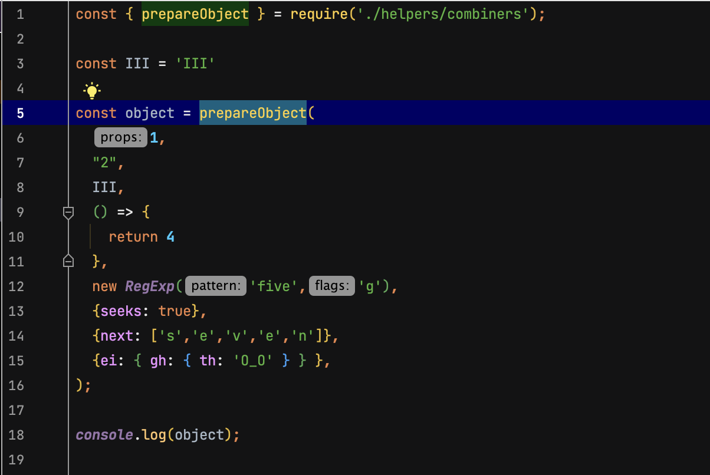
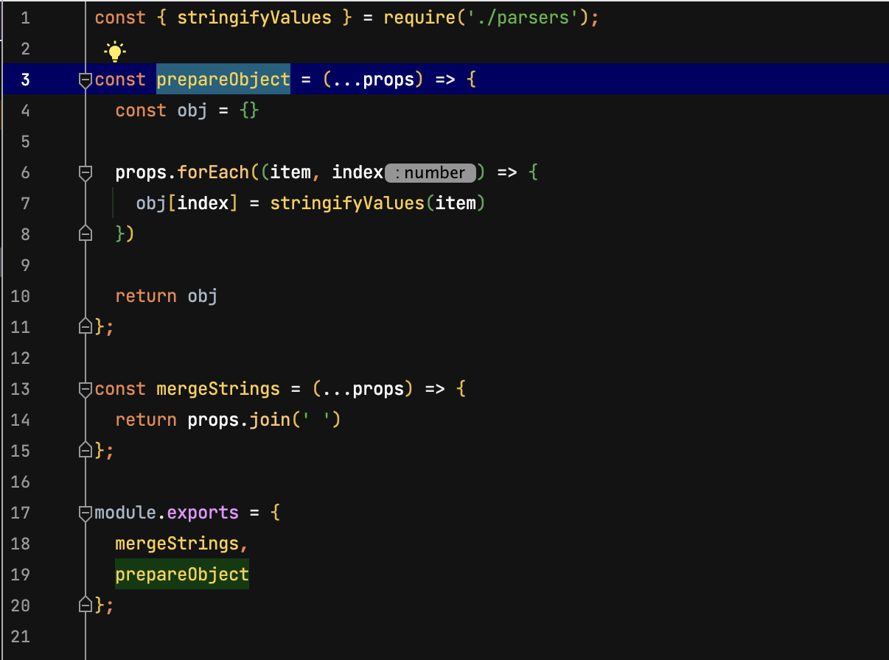
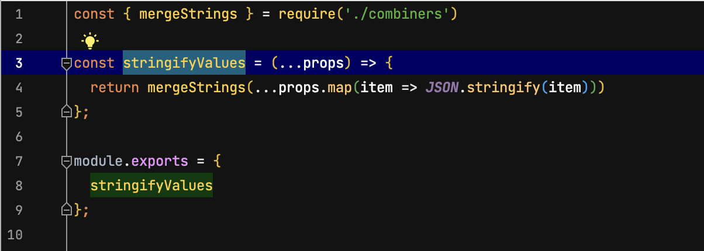
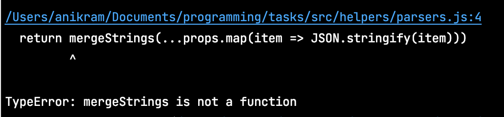

## Task

We are to send the list of very precious data to our personal cloud storage (provided by 3rd party).
Service provider validates every incoming object against the schema:

```
{
    "0": string,
    "1": string,
    ...
    "n": string,
}
```

Here is the project of ours which must combine and prepare values we want to send them into the cloud.


### Project view


### Main `src/index.js`


### Combiners `src/helpers/combiners.js`


### Parsers `src/helpers/parsers.js`



#### Choose what would be the result of this script execution?
1. 

```
   {
   '0': '1',
   '1': '"2"',
   '2': '"III"',
   '3': '',
   '4': '{}',
    ...
   }
```
2.

 ```
    {
    '0': '1',
    '1': '"2"',
    '2': '"III"',
    '3': '{}',
    '4': '',
        ...
    }
```

3.
 ```
    {
    '0': '1',
    '1': '2',
    '2': 'III',
    '3': '() => { return 4 })',
    '4': '',
        ...
    }
```
4
```
    TypeError: ... 
```

## Explanation: 

The answer is "4. TypeError: ..."   
The reason is - "circular dependency" between two modules.

If you run this script it will fail with "TypeError: mergeStrings is not a function" error 
at `line 4` of `src/helpers/parser.js`. 



When there are circular require() calls, a module might not have finished executing which leads to modules imports failures. The circular dependency is detected by Node.js,
and in order to avoid an infinite loop it returns the incompletely loaded module. In practice that leads to imported module be equal to an empty object, and empty's object destructured methods equals "undefined". That's why we will face TypeError in our example.
